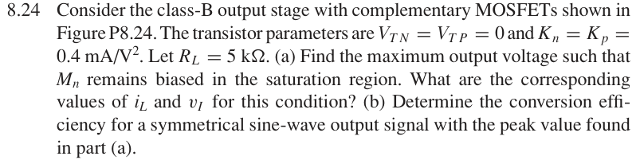
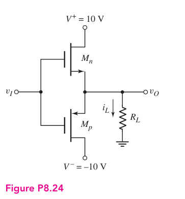

# 8.24 — 互补 MOS class-B

## 相关计算器

<a href="../../../tools/chapter8-calculators.html#classb" target="_blank" rel="noopener" style="display:inline-block;margin:0.2rem 0.35rem 0.2rem 0;padding:0.5rem 0.7rem;border:1px solid #2563eb;border-radius:0.5rem;text-decoration:none;font-weight:600;">Complementary MOS Class-B power ↗</a>

来源：Donald A. Neamen, *Microelectronics: Circuit Analysis and Design*, 4th ed.，教材页 609（PDF 第 632 页）。

<!-- instantiated-calculator -->
## 代入本题数值的计算器

### 最大摆幅点（Vp≈8 V, RL=5 kΩ）

<iframe src="../../../tools/chapter8-calculators.html?compact=1&tab=classb&bWave=sine&bVcc=10&bVp=8&bRl=5000" title="Problem 8.24 calculator — 最大摆幅点（Vp≈8 V, RL=5 kΩ）" style="width:100%;min-height:560px;border:1px solid #d1d5db;border-radius:12px;background:white;" loading="lazy"></iframe>

## 题目

Consider the class-B output stage with complementary MOSFETs shown in Figure P8.24. The transistor parameters are VTN = VTP = 0 and Kn = Kp = 0.4 mA/V². Let RL = 5 kΩ.

(a) Find the maximum output voltage such that Mn remains biased in the saturation region. What are the corresponding values of iL and vI for this condition?

(b) Determine the conversion efficiency for a symmetrical sine-wave output signal with the peak value found in part

(a).

## 原题截图

## 对应图片：Figure P8.24

图片来源：教材页 609（PDF 第 632 页）。 该图上的参数是原图标注；解题时应采用本题题干给定的参数。

[返回第 8 章目录](index.md)
