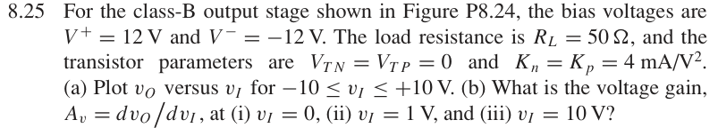

# 8.25 — MOS class-B 传输与增益

来源：Donald A. Neamen, *Microelectronics: Circuit Analysis and Design*, 4th ed.，教材页 609（PDF 第 632 页）。

## 题目

For the class-B output stage shown in Figure P8.24, the bias voltages are V+ = 12 V and V−= −12 V. The load resistance is RL = 50 Ω, and the transistor parameters are VTN = VTP = 0 and Kn = Kp = 4 mA/V².

(a) Plot vO versus vI for −10 ≤vI ≤+10 V.

(b) What is the voltage gain, Av = dvO/dvI , at (i) vI = 0, (ii) vI = 1 V, and (iii) vI = 10 V?

## 原题截图

## 对应图片：Figure P8.24

图片来源：教材页 609（PDF 第 632 页）。 该图上的参数是原图标注；解题时应采用本题题干给定的参数。

[返回第 8 章目录](index.md)
