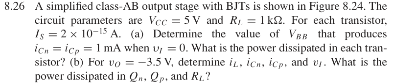
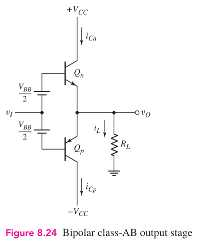

# 8.26 — BJT class-AB 偏置

来源：Donald A. Neamen, *Microelectronics: Circuit Analysis and Design*, 4th ed.，教材页 609（PDF 第 632 页）。

## 题目

A simplified class-AB output stage with BJTs is shown in Figure 8.24. The circuit parameters are VCC = 5 V and RL = 1 kΩ. For each transistor, IS = $2\times10^{-15}$ A.

(a) Determine the value of VBB that produces iCn = iCp = 1 mA when vI = 0. What is the power dissipated in each transistor?

(b) For vO = −3.5 V, determine iL, iCn, iCp, and vI . What is the power dissipated in Qn, Qp, and RL?

## 原题截图

## 对应图片：Figure 8.24

图片来源：教材页 582（PDF 第 605 页）。 这是章节正文中的图，图号没有 P 前缀。

[返回第 8 章目录](index.md)
