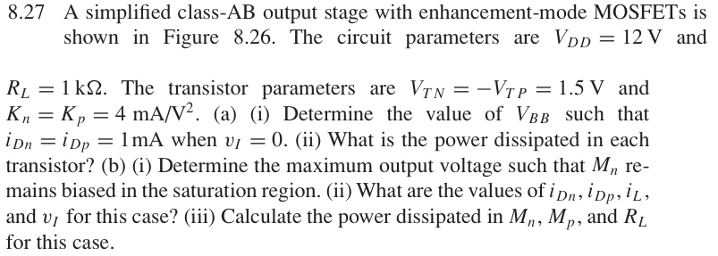

# 8.27 — MOS class-AB 偏置

## 相关计算器

<a href="../../../tools/chapter8-calculators.html#abbias" target="_blank" rel="noopener" style="display:inline-block;margin:0.2rem 0.35rem 0.2rem 0;padding:0.5rem 0.7rem;border:1px solid #2563eb;border-radius:0.5rem;text-decoration:none;font-weight:600;">MOS Class-AB bias ↗</a>
<a href="../../../tools/chapter8-calculators.html#classb" target="_blank" rel="noopener" style="display:inline-block;margin:0.2rem 0.35rem 0.2rem 0;padding:0.5rem 0.7rem;border:1px solid #2563eb;border-radius:0.5rem;text-decoration:none;font-weight:600;">AB output power / dissipation ↗</a>

来源：Donald A. Neamen, *Microelectronics: Circuit Analysis and Design*, 4th ed.，教材页 609, 610（PDF 第 632, 633 页）。

<!-- instantiated-calculator -->
## 代入本题数值的计算器

### (a) 静态偏置

<iframe src="../../../tools/chapter8-calculators.html?compact=1&tab=abbias&cType=mos&cK=4&cIq=1&cVt=1.5&cIb=0.2&cRl=1000&cVo=0" title="Problem 8.27 calculator — (a) 静态偏置" style="width:100%;min-height:560px;border:1px solid #d1d5db;border-radius:12px;background:white;" loading="lazy"></iframe>

### (b) 最大正输出附近

<iframe src="../../../tools/chapter8-calculators.html?compact=1&tab=abbias&cType=mos&cK=4&cIq=1&cVt=1.5&cIb=0.2&cRl=1000&cVo=10.39" title="Problem 8.27 calculator — (b) 最大正输出附近" style="width:100%;min-height:560px;border:1px solid #d1d5db;border-radius:12px;background:white;" loading="lazy"></iframe>

## 题目

A simplified class-AB output stage with enhancement-mode MOSFETs is shown in Figure 8.26. The circuit parameters are VDD = 12 V and RL = 1 kΩ. The transistor parameters are VTN = −VTP = 1.5 V and Kn = Kp = 4 mA/V².

(a) (i) Determine the value of VBB such that iDn = iDp = 1 mA when vI = 0. (ii) What is the power dissipated in each transistor?

(b) (i) Determine the maximum output voltage such that Mn remains biased in the saturation region. (ii) What are the values of iDn, iDp, iL, and vI for this case? (iii) Calculate the power dissipated in Mn, Mp, and RL for this case.

## 原题截图

## 对应图片：Figure 8.26

图片来源：教材页 584（PDF 第 607 页）。 这是章节正文中的图，图号没有 P 前缀。

[返回第 8 章目录](index.md)
