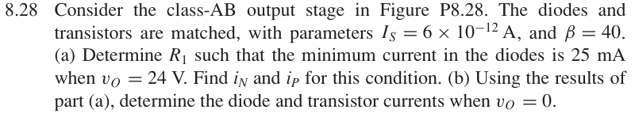
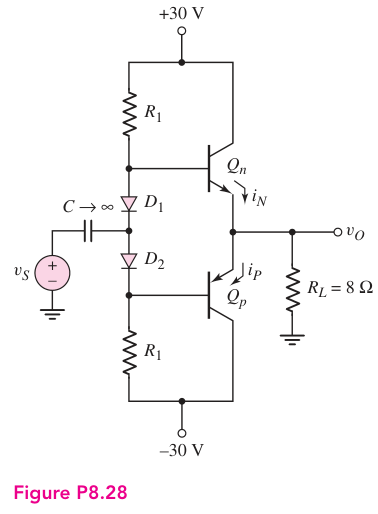

# 8.28 — 二极管偏置 class-AB

来源：Donald A. Neamen, *Microelectronics: Circuit Analysis and Design*, 4th ed.，教材页 610（PDF 第 633 页）。

## 题目

Consider the class-AB output stage in Figure P8.28. The diodes and transistors are matched, with parameters IS = $6\times10^{-12}$ A, and β = 40.

(a) Determine R1 such that the minimum current in the diodes is 25 mA when vO = 24 V. Find iN and iP for this condition.

(b) Using the results of part

(a), determine the diode and transistor currents when vO = 0.

## 原题截图

## 对应图片：Figure P8.28

图片来源：教材页 610（PDF 第 633 页）。 该图上的参数是原图标注；解题时应采用本题题干给定的参数。

[返回第 8 章目录](index.md)
