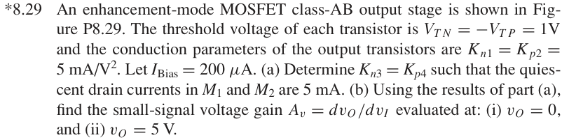
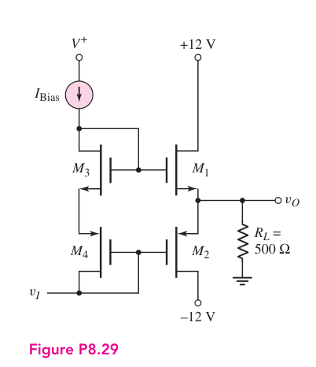

# *8.29 — MOS 偏置 class-AB 增益

来源：Donald A. Neamen, *Microelectronics: Circuit Analysis and Design*, 4th ed.，教材页 610（PDF 第 633 页）。

## 题目

An enhancement-mode MOSFET class-AB output stage is shown in Figure P8.29. The threshold voltage of each transistor is

\[
V_{TN}=-V_{TP}=1\,\mathrm{V}
\]

and the conduction parameters of the output transistors are

\[
K_{n1}=K_{p2}=5\,\mathrm{mA/V^2}.
\]

Let

\[
I_{\text{Bias}}=200\,\mu\mathrm{A}.
\]

(a) Determine \(K_{n3}=K_{p4}\) such that the quiescent drain currents in \(M_1\) and \(M_2\) are \(5\,\mathrm{mA}\).

(b) Using the results of part (a), find the small-signal voltage gain

\[
A_v=\frac{dv_O}{dv_I}
\]

evaluated at (i) \(v_O=0\), and (ii) \(v_O=5\,\mathrm{V}\).

## 原题截图

## 对应图片：Figure P8.29

图片来源：教材页 610（PDF 第 633 页）。该图上的参数是原图标注；解题时应采用本题题干给定的参数。

---

# 已知量

\[
V_{TN}=|V_{TP}|=1\,\mathrm{V}
\]

\[
K_{n1}=K_{p2}=5\,\mathrm{mA/V^2}
\]

\[
I_{\text{Bias}}=200\,\mu\mathrm{A}=0.2\,\mathrm{mA}
\]

\[
R_L=500\,\Omega
\]

静态条件下：

\[
I_{D1}=I_{D2}=5\,\mathrm{mA}
\]

本题采用

\[
I_D=\frac12KV_{OV}^2
\]

以及

\[
g_m=KV_{OV}.
\]

---

# (a) 求 \(K_{n3}=K_{p4}\)

## 展开图：从未知量一路展开到已知量

\[
\boxed{K_{n3}=K_{p4}=?}
\]

\[
\Downarrow
\]

\(M_3,M_4\) 的作用是建立 \(M_1,M_2\) 两个 gate 之间的偏置，因此在对称设计下：

\[
V_{OV3}=V_{OV1},
\qquad
V_{OV4}=V_{OV2}.
\]

先由输出管的静态电流求过驱动电压：

\[
I_{D1}=\frac12K_{n1}V_{OV1}^2
\]

\[
5\,\mathrm{mA}
=
\frac12
\left(5\,\mathrm{mA/V^2}\right)
V_{OV1}^2
\]

\[
\Downarrow
\]

\[
V_{OV1}^2=2
\]

\[
\boxed{
V_{OV1}=V_{OV2}=\sqrt2=1.414\,\mathrm{V}
}
\]

于是：

\[
\boxed{
V_{OV3}=V_{OV4}=1.414\,\mathrm{V}
}
\]

再利用 \(M_3,M_4\) 中的偏置电流：

\[
I_{\text{Bias}}
=
\frac12K_{n3}V_{OV3}^2
\]

\[
0.2\,\mathrm{mA}
=
\frac12K_{n3}(1.414)^2
\]

\[
\Downarrow
\]

\[
0.2=K_{n3}
\]

所以：

\[
\boxed{
K_{n3}=K_{p4}=0.20\,\mathrm{mA/V^2}
}
\]

### 最快的比例法

因为 \(M_1\) 与 \(M_3\) 具有相同的 \(V_{OV}\)，

\[
I_D\propto K.
\]

因此

\[
\frac{K_{n3}}{K_{n1}}
=
\frac{I_{\text{Bias}}}{I_{D1}}
=
\frac{0.2}{5}
=
\frac1{25}.
\]

所以立即得到：

\[
\boxed{
K_{n3}
=
\frac{5}{25}
=
0.20\,\mathrm{mA/V^2}
}
\]

---

# (b) 小信号增益

真正要找的是：

\[
\boxed{
A_v=\frac{dv_o}{dv_i}
}
\]

偏置网络使两个输出晶体管的 gate 在小信号下基本一起移动，因此：

\[
dv_{G1}=dv_{G2}=dv_i.
\]

输出节点的两个晶体管共同提供小信号电流：

\[
i_o
=
g_{m1}(v_i-v_o)
+
g_{m2}(v_i-v_o)
\]

\[
\Downarrow
\]

\[
i_o
=
(g_{m1}+g_{m2})(v_i-v_o).
\]

另一方面：

\[
i_o=\frac{v_o}{R_L}.
\]

所以：

\[
(g_{m1}+g_{m2})(v_i-v_o)
=
\frac{v_o}{R_L}
\]

\[
\Downarrow
\]

\[
(g_{m1}+g_{m2})v_i
=
v_o
\left(
g_{m1}+g_{m2}+\frac1{R_L}
\right)
\]

因此：

\[
\boxed{
A_v
=
\frac{v_o}{v_i}
=
\frac{(g_{m1}+g_{m2})R_L}
{1+(g_{m1}+g_{m2})R_L}
}
\]

整个问题于是压缩成：

\[
\boxed{
A_v
}
\]

\[
\Downarrow
\]

\[
\boxed{
A_v=\frac{G_mR_L}{1+G_mR_L}
}
\]

\[
\Downarrow
\]

\[
\boxed{
G_m=g_{m1}+g_{m2}
}
\]

\[
\Downarrow
\]

\[
\boxed{
g_m=KV_{OV}
}
\]

---

# (b)(i) 在 \(v_o=0\) 时

静态时：

\[
I_{D1}=I_{D2}=5\,\mathrm{mA}
\]

并且已经求得：

\[
V_{OV1}=V_{OV2}=1.414\,\mathrm{V}.
\]

所以：

\[
g_{m1}
=
K_{n1}V_{OV1}
\]

\[
=
(5\,\mathrm{mA/V^2})(1.414\,\mathrm V)
\]

\[
\boxed{
g_{m1}=7.071\,\mathrm{mS}
}
\]

同理：

\[
\boxed{
g_{m2}=7.071\,\mathrm{mS}
}
\]

所以：

\[
g_{m1}+g_{m2}
=
14.142\,\mathrm{mS}.
\]

代入 \(R_L=500\,\Omega\)：

\[
(g_{m1}+g_{m2})R_L
=
(14.142\times10^{-3})(500)
=
7.071.
\]

因此：

\[
A_v
=
\frac{7.071}{1+7.071}
\]

\[
\boxed{
A_v(v_o=0)\approx0.876
}
\]

---

# (b)(ii) 在 \(v_o=5\,\mathrm V\) 时

负载电流：

\[
I_L=\frac{v_o}{R_L}
\]

\[
=
\frac{5}{500}
\]

\[
\boxed{
I_L=10\,\mathrm{mA}
}
\]

所以此时两个输出管的电流不再相等：

\[
I_{D1}-I_{D2}=10\,\mathrm{mA}.
\]

但这里**不需要分别求 \(I_{D1}\) 和 \(I_{D2}\)**。

偏置网络保持两个 gate 之间的电压差基本不变，因此：

\[
V_{GS1}+V_{SG2}
=
\text{constant}.
\]

又因为：

\[
V_{GS1}=V_T+V_{OV1}
\]

\[
V_{SG2}=|V_T|+V_{OV2},
\]

阈值电压是常数，所以：

\[
\boxed{
V_{OV1}+V_{OV2}
=
\text{constant}
}
\]

在静态点：

\[
V_{OV1}+V_{OV2}
=
1.414+1.414
=
2.828\,\mathrm V.
\]

因此：

\[
g_{m1}+g_{m2}
=
KV_{OV1}+KV_{OV2}
\]

由于：

\[
K_{n1}=K_{p2}=K,
\]

所以：

\[
g_{m1}+g_{m2}
=
K(V_{OV1}+V_{OV2})
\]

\[
=
(5\,\mathrm{mA/V^2})(2.828\,\mathrm V)
\]

\[
\boxed{
g_{m1}+g_{m2}
=
14.142\,\mathrm{mS}
}
\]

于是：

\[
A_v
=
\frac{(14.142\times10^{-3})(500)}
{1+(14.142\times10^{-3})(500)}
\]

\[
\boxed{
A_v(v_o=5\,\mathrm V)\approx0.876
}
\]

---

# Interactive Design Calculator

下面的计算器是独立网页，并通过 iframe 嵌入本页。修改 \(K\)、\(I_Q\)、\(I_{\text{Bias}}\)、\(R_L\)、\(v_O\) 或 \(|V_T|\) 后，结果会实时更新。

<iframe
  src="../../../tools/class-ab-calculator.html"
  title="Class-AB MOSFET Design Calculator"
  style="width:100%; min-height:1500px; border:1px solid #d1d5db; border-radius:12px; background:white;"
  loading="lazy">
</iframe>

---

# 最终答案

\[
\boxed{
K_{n3}=K_{p4}=0.20\,\mathrm{mA/V^2}
}
\]

\[
\boxed{
A_v(v_o=0)\approx0.876
}
\]

\[
\boxed{
A_v(v_o=5\,\mathrm V)\approx0.876
}
\]

---

# 最核心的直觉

这道题真正漂亮的地方不是分别追踪两个 MOSFET 的电流，而是发现：

\[
\boxed{
V_{OV1}+V_{OV2}
=
\text{constant}
}
\]

因此：

\[
\boxed{
g_{m1}+g_{m2}
=
K(V_{OV1}+V_{OV2})
=
\text{constant}
}
\]

于是：

\[
\boxed{
A_v
=
\frac{(g_{m1}+g_{m2})R_L}
{1+(g_{m1}+g_{m2})R_L}
}
\]

也基本保持不变。

当输出向正方向移动时：

\[
g_{m1}\uparrow
\]

同时：

\[
g_{m2}\downarrow
\]

但近似有：

\[
\boxed{
g_{m1}+g_{m2}=\text{constant}.
}
\]

这正是这个 class-AB 输出级能够在较大输出范围内维持近似恒定小信号增益的原因。

[返回第 8 章目录](index.md)
