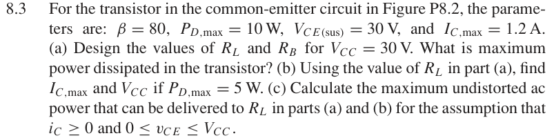

# 8.3 — 共射极负载线设计

## 相关计算器

<a href="../../../tools/chapter8-calculators.html#a" target="_blank" rel="noopener" style="display:inline-block;margin:0.2rem 0.35rem 0.2rem 0;padding:0.5rem 0.7rem;border:1px solid #2563eb;border-radius:0.5rem;text-decoration:none;font-weight:600;">Class-A load-line / maximum output ↗</a>

来源：Donald A. Neamen, *Microelectronics: Circuit Analysis and Design*, 4th ed.，教材页 605（PDF 第 628 页）。

## 题目

For the transistor in the common-emitter circuit in Figure P8.2, the parameters are: β = 80, PD,max = 10 W, VCE(sus) = 30 V, and IC,max = 1.2 A.

(a) Design the values of RL and RB for VCC = 30 V. What is maximum power dissipated in the transistor?

(b) Using the value of RL in part

(a), find IC,max and VCC if PD,max = 5 W.

(c) Calculate the maximum undistorted ac power that can be delivered to RL in parts

(a) and

(b) for the assumption that iC ≥0 and 0 ≤vC E ≤VCC.

## 原题截图

## 对应图片：Figure P8.2

图片来源：教材页 605（PDF 第 628 页）。 该图上的参数是原图标注；解题时应采用本题题干给定的参数。

[返回第 8 章目录](index.md)
