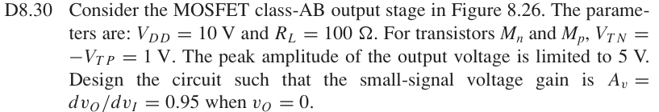
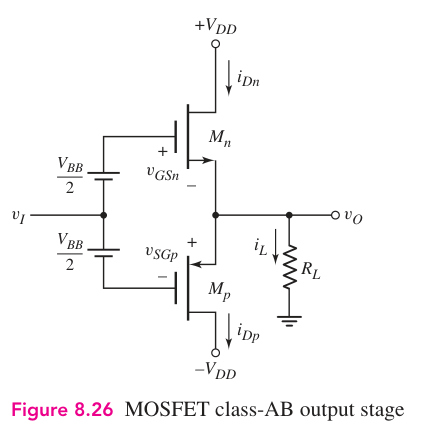

# D8.30 — MOS class-AB 增益设计

## 教材对应知识点

- **§8.3.3 Class-AB Operation，教材 pp. 583–585，尤其 Example 8.7 / Ex. 8.7**
- Design-oriented 反推：从目标 \(A_v\) 得到所需总 \(g_m\)，再结合 \(R_L\)、输出幅度和 MOS 偏置确定器件参数。

## 相关计算器

## 原题截图

## 对应图片：Figure 8.26

图片来源：教材页 584（PDF 第 607 页）。 这是章节正文中的图，图号没有 P 前缀。

[返回第 8 章目录](index.md)

<a href="../../../tools/chapter8-calculators.html#abbias" target="_blank" rel="noopener" style="display:inline-block;margin:0.2rem 0.35rem 0.2rem 0;padding:0.5rem 0.7rem;border:1px solid #2563eb;border-radius:0.5rem;text-decoration:none;font-weight:600;">MOS Class-AB bias ↗</a>
<a href="../../../tools/chapter8-calculators.html#follower" target="_blank" rel="noopener" style="display:inline-block;margin:0.2rem 0.35rem 0.2rem 0;padding:0.5rem 0.7rem;border:1px solid #2563eb;border-radius:0.5rem;text-decoration:none;font-weight:600;">Design mode: target Av → required gm ↗</a>

来源：Donald A. Neamen, *Microelectronics: Circuit Analysis and Design*, 4th ed.，教材页 610（PDF 第 633 页）。

<!-- instantiated-calculator -->
## 代入本题数值的计算器

### 目标 Av=0.95，RL=100 Ω → 所需总 Gm

<iframe src="../../../tools/chapter8-calculators.html?compact=1&tab=follower&fMode=design&fRl=100&fAvTarget=0.95&fig=fig-8-26.webp" title="Problem 8.30 calculator — 目标 Av=0.95，RL=100 Ω → 所需总 Gm" style="width:100%;min-height:560px;border:1px solid #d1d5db;border-radius:12px;background:white;" loading="lazy"></iframe>

## 题目

Consider the MOSFET class-AB output stage in Figure 8.26. The parameters are: VDD = 10 V and RL = 100 Ω. For transistors Mn and Mp, VTN = −VTP = 1 V. The peak amplitude of the output voltage is limited to 5 V. Design the circuit such that the small-signal voltage gain is Av = dvO/dvI = 0.95 when vO = 0.

