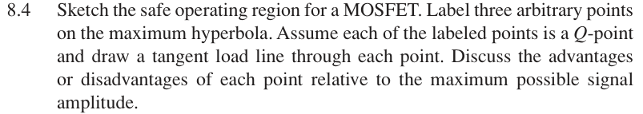

# 8.4 — MOSFET 工作区与切线

## 相关计算器

<a href="../../../tools/chapter8-calculators.html#a" target="_blank" rel="noopener" style="display:inline-block;margin:0.2rem 0.35rem 0.2rem 0;padding:0.5rem 0.7rem;border:1px solid #2563eb;border-radius:0.5rem;text-decoration:none;font-weight:600;">Load-line / power operating point ↗</a>

来源：Donald A. Neamen, *Microelectronics: Circuit Analysis and Design*, 4th ed.，教材页 605（PDF 第 628 页）。

## 题目

Sketch the safe operating region for a MOSFET. Label three arbitrary points on the maximum hyperbola. Assume each of the labeled points is a Q-point and draw a tangent load line through each point. Discuss the advantages or disadvantages of each point relative to the maximum possible signal amplitude.

## 原题截图

## 图片对应

本题没有引用教材中的电路图；要求自行绘制的图应根据题干条件作出。

[返回第 8 章目录](index.md)
