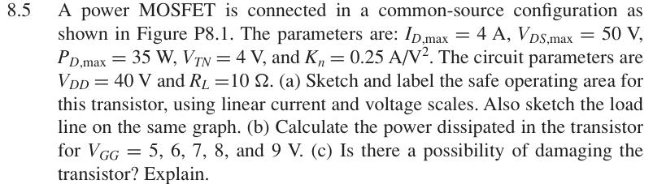
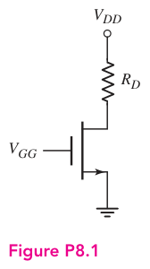

# 8.5 — MOSFET 功耗与损坏判断

## 相关计算器

<a href="../../../tools/chapter8-calculators.html#a" target="_blank" rel="noopener" style="display:inline-block;margin:0.2rem 0.35rem 0.2rem 0;padding:0.5rem 0.7rem;border:1px solid #2563eb;border-radius:0.5rem;text-decoration:none;font-weight:600;">MOS power operating point ↗</a>
<a href="../../../tools/chapter8-calculators.html#thermal" target="_blank" rel="noopener" style="display:inline-block;margin:0.2rem 0.35rem 0.2rem 0;padding:0.5rem 0.7rem;border:1px solid #2563eb;border-radius:0.5rem;text-decoration:none;font-weight:600;">Thermal / dissipation check ↗</a>

来源：Donald A. Neamen, *Microelectronics: Circuit Analysis and Design*, 4th ed.，教材页 605（PDF 第 628 页）。

<!-- instantiated-calculator -->
## 代入本题数值的计算器

### VGG=5 V

<iframe src="../../../tools/chapter8-calculators.html?compact=1&tab=mosout&mMode=dc&mK=0.25&mVt=4&mVdd=40&mRl=10&mVg=5" title="Problem 8.5 calculator — VGG=5 V" style="width:100%;min-height:560px;border:1px solid #d1d5db;border-radius:12px;background:white;" loading="lazy"></iframe>

### VGG=6 V

<iframe src="../../../tools/chapter8-calculators.html?compact=1&tab=mosout&mMode=dc&mK=0.25&mVt=4&mVdd=40&mRl=10&mVg=6" title="Problem 8.5 calculator — VGG=6 V" style="width:100%;min-height:560px;border:1px solid #d1d5db;border-radius:12px;background:white;" loading="lazy"></iframe>

### VGG=7 V

<iframe src="../../../tools/chapter8-calculators.html?compact=1&tab=mosout&mMode=dc&mK=0.25&mVt=4&mVdd=40&mRl=10&mVg=7" title="Problem 8.5 calculator — VGG=7 V" style="width:100%;min-height:560px;border:1px solid #d1d5db;border-radius:12px;background:white;" loading="lazy"></iframe>

### VGG=8 V

<iframe src="../../../tools/chapter8-calculators.html?compact=1&tab=mosout&mMode=dc&mK=0.25&mVt=4&mVdd=40&mRl=10&mVg=8" title="Problem 8.5 calculator — VGG=8 V" style="width:100%;min-height:560px;border:1px solid #d1d5db;border-radius:12px;background:white;" loading="lazy"></iframe>

### VGG=9 V

<iframe src="../../../tools/chapter8-calculators.html?compact=1&tab=mosout&mMode=dc&mK=0.25&mVt=4&mVdd=40&mRl=10&mVg=9" title="Problem 8.5 calculator — VGG=9 V" style="width:100%;min-height:560px;border:1px solid #d1d5db;border-radius:12px;background:white;" loading="lazy"></iframe>

## 题目

A power MOSFET is connected in a common-source configuration as shown in Figure P8.1. The parameters are: ID,max = 4 A, VDS,max = 50 V, PD,max = 35 W, VTN = 4 V, and Kn = 0.25 A/V². The circuit parameters are VDD = 40 V and RL = 10 Ω.

(a) Sketch and label the safe operating area for this transistor, using linear current and voltage scales. Also sketch the load line on the same graph.

(b) Calculate the power dissipated in the transistor for VGG = 5, 6, 7, 8, and 9 V.

(c) Is there a possibility of damaging the transistor? Explain.

## 原题截图

## 对应图片：Figure P8.1

图片来源：教材页 605（PDF 第 628 页）。 该图上的参数是原图标注；解题时应采用本题题干给定的参数。

[返回第 8 章目录](index.md)
