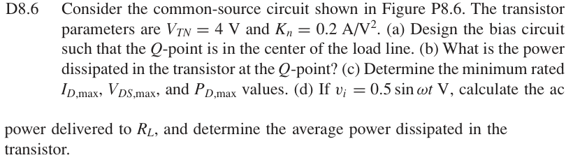
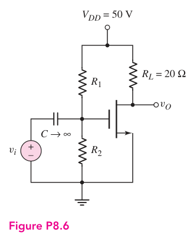

# D8.6 — 共源极偏置设计

## 相关计算器

<a href="../../../tools/chapter8-calculators.html#a" target="_blank" rel="noopener" style="display:inline-block;margin:0.2rem 0.35rem 0.2rem 0;padding:0.5rem 0.7rem;border:1px solid #2563eb;border-radius:0.5rem;text-decoration:none;font-weight:600;">Class-A bias / load-line ↗</a>

来源：Donald A. Neamen, *Microelectronics: Circuit Analysis and Design*, 4th ed.，教材页 605, 606（PDF 第 628, 629 页）。

## 题目

Consider the common-source circuit shown in Figure P8.6. The transistor parameters are VTN = 4 V and Kn = 0.2 A/V².

(a) Design the bias circuit such that the Q-point is in the center of the load line.

(b) What is the power dissipated in the transistor at the Q-point?

(c) Determine the minimum rated ID,max, VDS,max, and PD,max values. (d) If vi = 0.5 sin ωt V, calculate the ac power delivered to RL, and determine the average power dissipated in the transistor.

## 原题截图

## 对应图片：Figure P8.6

图片来源：教材页 606（PDF 第 629 页）。 该图上的参数是原图标注；解题时应采用本题题干给定的参数。

[返回第 8 章目录](index.md)
