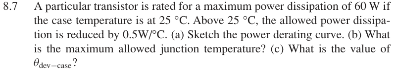

# 8.7 — 功率降额曲线

## 教材对应知识点

- **§8.2 Heat Sinks / Power Derating，教材 pp. 569–570**
- Power derating curve、\(T_{J,\max}\)、\(\theta_{dev-case}\) 与最大安全耗散功率。

## 相关计算器

## 原题截图

## 图片对应

本题没有引用教材中的电路图；要求自行绘制的图应根据题干条件作出。

[返回第 8 章目录](index.md)

<a href="../../../tools/chapter8-calculators.html#thermal" target="_blank" rel="noopener" style="display:inline-block;margin:0.2rem 0.35rem 0.2rem 0;padding:0.5rem 0.7rem;border:1px solid #2563eb;border-radius:0.5rem;text-decoration:none;font-weight:600;">Thermal derating ↗</a>

来源：Donald A. Neamen, *Microelectronics: Circuit Analysis and Design*, 4th ed.，教材页 606（PDF 第 629 页）。

<!-- instantiated-calculator -->
## 代入本题数值的计算器

### Derating 对应热阻

<iframe src="../../../tools/chapter8-calculators.html?compact=1&tab=thermal&tTjmax=145&tTa=25&tPd=60&tJC=2&tCS=0&tSA=0" title="Problem 8.7 calculator — Derating 对应热阻" style="width:100%;min-height:560px;border:1px solid #d1d5db;border-radius:12px;background:white;" loading="lazy"></iframe>

## 题目

A particular transistor is rated for a maximum power dissipation of 60 W if the case temperature is at 25 °C. Above 25 °C, the allowed power dissipation is reduced by 0.5 W/°C.

(a) Sketch the power derating curve.

(b) What is the maximum allowed junction temperature?

(c) What is the value of θdev−case?

