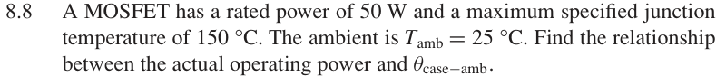

# 8.8 — 热阻与允许功率

## 相关计算器

<a href="../../../tools/chapter8-calculators.html#thermal" target="_blank" rel="noopener" style="display:inline-block;margin:0.2rem 0.35rem 0.2rem 0;padding:0.5rem 0.7rem;border:1px solid #2563eb;border-radius:0.5rem;text-decoration:none;font-weight:600;">Thermal resistance ↗</a>

来源：Donald A. Neamen, *Microelectronics: Circuit Analysis and Design*, 4th ed.，教材页 606（PDF 第 629 页）。

## 题目

A MOSFET has a rated power of 50 W and a maximum specified junction temperature of 150 °C. The ambient is Tamb = 25 °C. Find the relationship between the actual operating power and θcase−amb.

## 原题截图

## 图片对应

本题没有引用教材中的电路图；要求自行绘制的图应根据题干条件作出。

[返回第 8 章目录](index.md)
