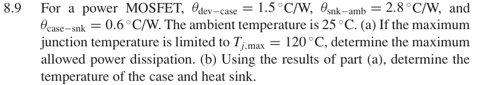

# 8.9 — 散热器热阻网络

## 相关计算器

<a href="../../../tools/chapter8-calculators.html#thermal" target="_blank" rel="noopener" style="display:inline-block;margin:0.2rem 0.35rem 0.2rem 0;padding:0.5rem 0.7rem;border:1px solid #2563eb;border-radius:0.5rem;text-decoration:none;font-weight:600;">Heat-sink thermal network ↗</a>

来源：Donald A. Neamen, *Microelectronics: Circuit Analysis and Design*, 4th ed.，教材页 606（PDF 第 629 页）。

## 题目

For a power MOSFET, θdev−case = 1.5 ◦C/W, θsnk−amb = 2.8 ◦C/W, and θcase−snk = 0.6 ◦C/W. The ambient temperature is 25 ◦C.

(a) If the maximum junction temperature is limited to Tj,max = 120 ◦C, determine the maximum allowed power dissipation.

(b) Using the results of part

(a), determine the temperature of the case and heat sink.

## 原题截图

## 图片对应

本题没有引用教材中的电路图；要求自行绘制的图应根据题干条件作出。

[返回第 8 章目录](index.md)
