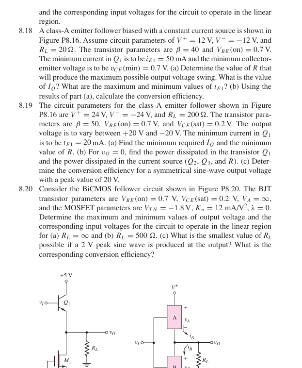

# 第 8 章：功率放大器

已加入 8.18–8.20 的题目、已知条件与可确定的推导。

| 题目 | 内容 | 当前状态 |
|---|---|---|
| [8.18](8-18.md) | 恒流偏置 class-A 射极跟随器 | 电流与摆幅关系已推导；偏置电阻和完整效率待图 P8.16 |
| [8.19](8-19.md) | ±20 V 输出的 class-A 设计 | 最小偏置电流、输出功率已计算；其余待图 P8.16 |
| [8.20](8-20.md) | BiCMOS 跟随器 | 已整理参数与计算关系；待完整图 P8.20 |

这里的缺图标记对应截图实际缺失的连接。数值结果仅在各题注明的条件下使用。

## 题目截图

