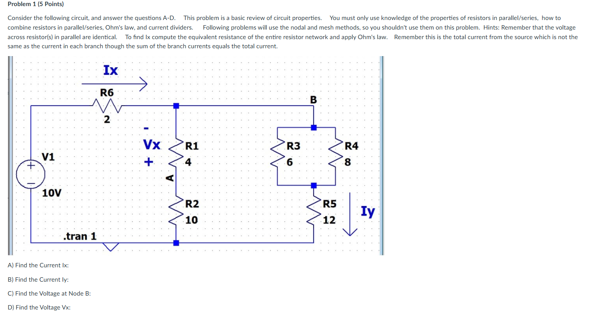
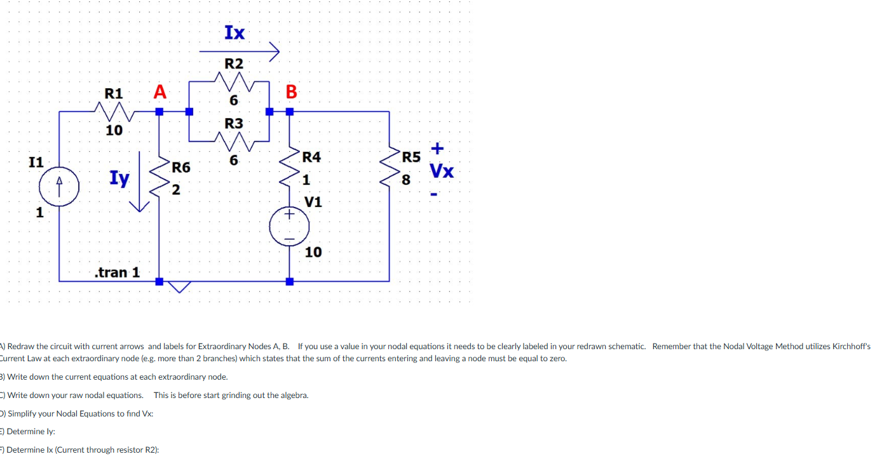
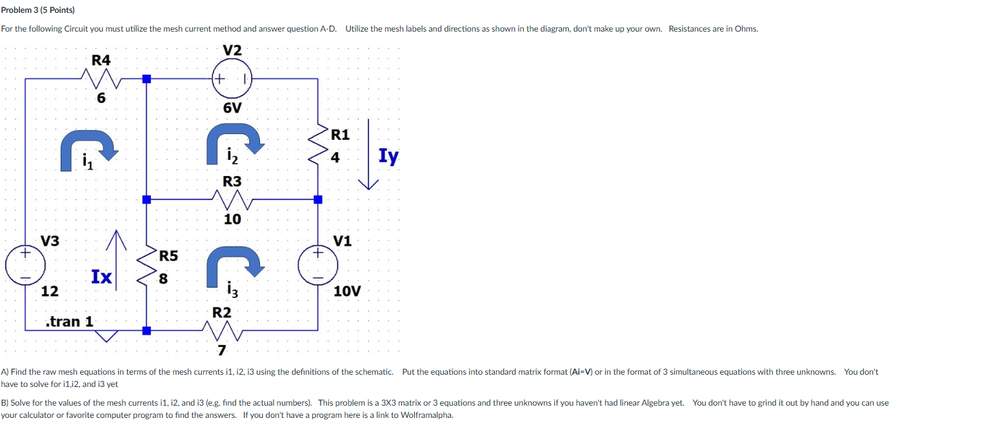

# ENGR 202

**Electrical Fundamentals II · Fall 2026**

三道电路复习题：串并联化简、节点电压法和网孔电流法。每题保留原题截图，并附计算结果及可直接运行的 LTspice 文件。

[下载全部题目与 LTspice 文件（ZIP）](../assets/downloads/engr202/ENGR202_Problems1-3_LTspice_Log.zip){ .md-button .md-button--primary download }

## 使用方法

1. 下载并完整解压 ZIP，进入对应的 `Problem1`、`Problem2` 或 `Problem3` 文件夹。
2. 用 LTspice 打开该题的 **`ProblemN_Log.asc`**。
3. 点击 **Run**，运行结束后按 **Ctrl+L**，打开 SPICE Output / Error Log。
4. 日志中以 `Ix_A`、`Iy_A`、`Vx_V` 等名称开头的测量行，就是对应的数值答案。名称可能显示为小写。

所有测量公式已写入文件，无需手动添加波形或输入表达式。`_A` 表示安培，`_V` 表示伏特。负值表示实际方向与题目规定的参考方向相反。

| 题目 | 方法 | LTspice 原理图 | SPICE 网表 |
|---|---|---|---|
| [Problem 1](#problem-1) | 串并联、欧姆定律、分流与分压 | [Problem1_Log.asc](../assets/downloads/engr202/Problem1_Log.asc){ download } | [Problem1_Log.cir](../assets/downloads/engr202/Problem1_Log.cir){ download } |
| [Problem 2](#problem-2) | 节点电压法（KCL） | [Problem2_Log.asc](../assets/downloads/engr202/Problem2_Log.asc){ download } | [Problem2_Log.cir](../assets/downloads/engr202/Problem2_Log.cir){ download } |
| [Problem 3](#problem-3) | 网孔电流法（KVL） | [Problem3_Log.asc](../assets/downloads/engr202/Problem3_Log.asc){ download } | [Problem3_Log.cir](../assets/downloads/engr202/Problem3_Log.cir){ download } |

如果浏览器把 `.asc` 或 `.cir` 显示成文本，可使用上方的 ZIP 下载，或右键链接另存为。

## Problem 1

### 原题截图

[打开原尺寸截图](../assets/images/engr202/problem-1.png)

### 题目要求

仅使用电阻串并联、欧姆定律和分流公式；本题不要使用节点电压法或网孔电流法。

- **A：** 求总电流 $I_x$，参考方向沿 $R_6$ 向右。
- **B：** 求 $I_y$，参考方向沿 $R_5$ 向下。
- **C：** 求节点 B 相对于地的电压 $V_B$。
- **D：** 求 $V_x$，注意图中为**下正、上负**，即 $V_x=V_A-V_B$。

### 计算与答案

先把 $R_3$、$R_4$ 并联，再与 $R_5$ 串联；这一支路与 $R_1+R_2$ 并联，最后与 $R_6$ 串联：

$$
R_{34}=6\parallel8=\frac{24}{7}\ \Omega,
\qquad R_{\mathrm{right}}=\frac{24}{7}+12=\frac{108}{7}\ \Omega.
$$

$$
R_{\mathrm{total}}
=2+\left[14\parallel\frac{108}{7}\right]
=\frac{962}{103}\ \Omega.
$$

$$
\begin{aligned}
I_x&=\frac{10}{R_{\mathrm{total}}}=\frac{515}{481}\ \mathrm A,\\
I_y&=I_x\frac{14}{14+108/7}=\frac{245}{481}\ \mathrm A,\\
V_B&=10-I_xR_6=\frac{3780}{481}\ \mathrm V,\\
V_x&=-V_B\frac{R_1}{R_1+R_2}=-\frac{1080}{481}\ \mathrm V.
\end{aligned}
$$

| 小问 | 日志名称 | 数值答案 |
|---|---|---:|
| A · $I_x$ | `Ix_A` | **1.070686 A** |
| B · $I_y$ | `Iy_A` | **0.509356 A** |
| C · $V_B$ | `VB_V` | **7.858628 V** |
| D · $V_x$ | `Vx_V` | **−2.245322 V** |

[下载完整串并联推导](../assets/downloads/engr202/Problem1_Solution.md.txt){ download } · [下载原理图](../assets/downloads/engr202/Problem1_Log.asc){ download } · [查看 ngspice 验证日志](../assets/downloads/engr202/Problem1_ngspice.log)

## Problem 2

### 原题截图

[打开原尺寸截图](../assets/images/engr202/problem-2.png)

### 题目要求

- **A：** 重画电路，标出电流箭头以及连接多于两条支路的节点 A、B；方程中使用的量要在图上标明。
- **B：** 对每个这样的节点写出电流方程。
- **C：** 写出尚未整理的节点电压方程。
- **D：** 整理并求出 $V_x$。
- **E：** 求向下流过 $R_6$ 的 $I_y$。
- **F：** 求向右流过 **$R_2$ 单个电阻**的 $I_x$。

### 节点方程

左侧电流源使 1 A 电流经 $R_1$ 流入 A。$R_4$ 下方的电压源正端为 10 V；$R_5$ 下端接地，所以 $V_x=V_B$。

节点 A：

$$
\frac{V_A}{2}+\frac{V_A-V_B}{6}+\frac{V_A-V_B}{6}=1.
$$

节点 B：

$$
\frac{V_B-V_A}{6}+\frac{V_B-V_A}{6}
+\frac{V_B}{8}+\frac{V_B-10}{1}=0.
$$

清除分母后：

$$
\begin{bmatrix}5&-2\\-8&35\end{bmatrix}
\begin{bmatrix}V_A\\V_B\end{bmatrix}
=\begin{bmatrix}6\\240\end{bmatrix}.
$$

$$
V_A=\frac{230}{53}\ \mathrm V,\qquad
V_B=V_x=\frac{416}{53}\ \mathrm V,
$$

$$
I_y=\frac{V_A}{2}=\frac{115}{53}\ \mathrm A,\qquad
I_x=\frac{V_A-V_B}{6}=-\frac{31}{53}\ \mathrm A.
$$

| 量 | 日志名称 | 数值答案 |
|---|---|---:|
| 节点 A 电压 | `VA_V` | **4.339623 V** |
| 节点 B 电压 | `VB_V` | **7.849057 V** |
| D · $V_x$ | `Vx_V` | **7.849057 V** |
| E · $I_y$ | `Iy_A` | **2.169811 A** |
| F · $I_x$ | `Ix_A` | **−0.584906 A** |

$I_x$ 为负，说明 $R_2$ 中实际电流从 B 流向 A。它不是 $R_2$ 和 $R_3$ 两条支路的电流之和。

[下载节点与网孔推导](../assets/downloads/engr202/Problems2-3_Equations.md.txt){ download } · [下载原理图](../assets/downloads/engr202/Problem2_Log.asc){ download } · [查看 ngspice 验证日志](../assets/downloads/engr202/Problem2_ngspice.log)

## Problem 3

### 原题截图

[打开原尺寸截图](../assets/images/engr202/problem-3.png)

### 题目要求

必须使用网孔电流法，并沿用题图规定的 $i_1,i_2,i_3$ 名称及**顺时针方向**。

- **A：** 写出三个原始网孔方程，并整理为矩阵或三元一次方程组。
- **B：** 求三个网孔电流的数值。
- 同时记录图中标出的 $I_x$、$I_y$。所提供截图的下方正文只显示到 B 问。

### 网孔方程

左侧网孔：

$$6i_1+8(i_1-i_3)=12.$$

右上网孔：沿顺时针经过 $V_2$ 是从正端到负端，所以电源电压升为 $-6\ \mathrm V$。

$$4i_2+10(i_2-i_3)=-6.$$

右下网孔：沿顺时针经过 $V_1$ 是从正端到负端，所以电源电压升为 $-10\ \mathrm V$。

$$8(i_3-i_1)+10(i_3-i_2)+7i_3=-10.$$

$$
\boxed{
\begin{bmatrix}
14&0&-8\\
0&14&-10\\
-8&-10&25
\end{bmatrix}
\begin{bmatrix}i_1\\i_2\\i_3\end{bmatrix}
=\begin{bmatrix}12\\-6\\-10\end{bmatrix}
}
$$

$$
i_1=\frac{50}{93}\ \mathrm A,\qquad
i_2=-\frac{77}{93}\ \mathrm A,\qquad
i_3=-\frac{52}{93}\ \mathrm A.
$$

图中的 $I_x$ 沿 $R_5$ 向上，因此 $I_x=i_3-i_1$；$I_y$ 沿 $R_1$ 向下，因此 $I_y=i_2$。

| 量 | 日志名称 | 数值答案 |
|---|---|---:|
| 左侧网孔 $i_1$ | `i1_A` | **0.537634 A** |
| 右上网孔 $i_2$ | `i2_A` | **−0.827957 A** |
| 右下网孔 $i_3$ | `i3_A` | **−0.559140 A** |
| $I_x=i_3-i_1$ | `Ix_A` | **−1.096774 A** |
| $I_y=i_2$ | `Iy_A` | **−0.827957 A** |

[下载节点与网孔推导](../assets/downloads/engr202/Problems2-3_Equations.md.txt){ download } · [下载原理图](../assets/downloads/engr202/Problem3_Log.asc){ download } · [查看 ngspice 验证日志](../assets/downloads/engr202/Problem3_ngspice.log)

## 文件与验证说明

整包包含三道原题截图、每题的 `.asc` 和 `.cir` 文件、计算推导及验证记录。
三个电路的连接和 14 项数值输出已用 ngspice 实际运行核对，结果与手算一致。
下载的验证日志标为 ngspice；在 LTspice 中点击 Run 后，会生成本机的 LTspice 日志。Windows 版 LTspice 界面未在生成环境中实测。

AI assistance: ChatGPT was used to explain and check the calculations and prepare the SPICE files.
