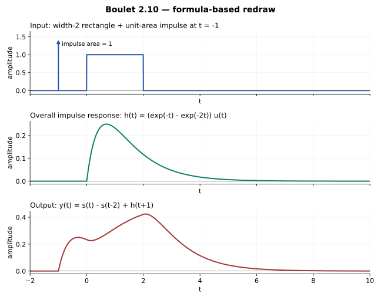

# 2.10 — 串联系统如何变成并联相减

## 题意（重述）

Boulet pp.89–90，Figure 2.48：两个 LTI 子系统串联，

\[
h_1(t)=e^{-t}u(t),\qquad h_2(t)=e^{-2t}u(t),
\]

\[
x(t)=u(t)-u(t-2)+\delta(t+1).
\]

(a) 求总冲激响应；(b) 给出等价并联结构；(c) 画输入并求输出。输入包含 \([0,2)\) 上的矩形和 \(t=-1\) 处面积为 1 的冲激。

## 时域与频域的交换图

令 \(C_hx=h*x\)、\(M_HX=HX\)。

\[
\begin{array}{ccc}
x & \xrightarrow{C_{h_2}C_{h_1}} & y\\
{\scriptstyle\mathcal F}\downarrow && \downarrow{\scriptstyle\mathcal F}\\
X & \xrightarrow{M_{H_2H_1}} & Y
\end{array}
\]

Osgood 的约定给出 \(H_a(\nu)=1/(a+2\pi i\nu)\)。令 \(p=2\pi i\nu\) 仅作简写：

\[
H_1H_2=\frac1{(p+1)(p+2)}
=\frac1{p+1}-\frac1{p+2}.
\]

## (a) 总冲激响应

反变换直接得到

\[
\boxed{h(t)=h_1*h_2=(e^{-t}-e^{-2t})u(t).}
\]

也可用一次短积分核对：

\[
\int_0^t e^{-\tau}e^{-2(t-\tau)}d\tau=e^{-t}-e^{-2t},\qquad t\ge0.
\]

## (b) 并联结构

对任意输入，

\[
\boxed{C_{h_2}C_{h_1}=C_{h_1}-C_{h_2}.}
\]

把同一个输入送入两支路，第一支路冲激响应为 \(h_1\)，第二支路为 \(-h_2\)，最后相加；等价地，使用 \(h_1,h_2\) 两支路，再做减法。

\[
\begin{array}{ccccc}
&& C_{h_1}x &&\\
&\nearrow && \searrow &\\
x &&&& y=C_{h_1}x-C_{h_2}x\\
&\searrow && \nearrow &\\
&& C_{h_2}x &&
\end{array}
\]

下支路进入输出时取负号。**系统串联虽然总是乘积，但只有这里的具体部分分式关系才让它等于这两个支路相减。**

## (c) 先求总阶跃响应

\[
s_h(t)=(h*u)(t)
=\left(\frac12-e^{-t}+\frac12e^{-2t}\right)u(t)
=\frac12(1-e^{-t})^2u(t).
\]

利用线性、平移与 \(h*\delta(t+1)=h(t+1)\)：

\[
\boxed{y(t)=s_h(t)-s_h(t-2)+h(t+1).}
\]

为了画图，完整分段式是

\[
y(t)=\begin{cases}
0,&t<-1,\\
e^{-(t+1)}-e^{-2(t+1)},&-1\le t<0,\\
\frac12(1-e^{-t})^2+e^{-(t+1)}-e^{-2(t+1)},&0\le t<2,\\
\frac12\left[(1-e^{-t})^2-(1-e^{-(t-2)})^2\right]
+e^{-(t+1)}-e^{-2(t+1)},&t\ge2.
\end{cases}
\]

## 核对

\(h(0^+)=0\)，所以输入的冲激不会在输出中保留为冲激，输出从 \(t=-1\) 连续开始。\(h\ge0\)，输入也是非负测度，因此输出非负。

面积关系为

\[
\int h=1-\frac12=\frac12,\qquad
\int x=2+1=3,\qquad \int y=\frac32.
\]

还可以代回 \((D+1)(D+2)y=x\)；此等式按分布理解。

## Osgood 对应观点

§3.3，pp.167–169；§8.4，pp.492–493；§8.7，pp.504–507。交换图先解释“串联为何变乘法”，部分分式再产生并联结构。

---

[返回目录](index.md)
