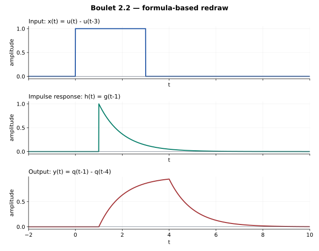

# 2.2 — 矩形输入：只算一次阶跃响应

## 题意（重述）

Boulet pp.84–86，Figure 2.39：系统的冲激响应与输入为

\[
h(t)=e^{-(t-1)}u(t-1),\qquad x(t)=u(t)-u(t-3).
\]

求并画出 \(y=h*x\)。上图由这些公式重新绘制。

## 先把延迟提出来

定义 \(g(t)=e^{-t}u(t)\)，\(q=g*u\)。那么

\[
h=\tau_1g,\qquad x=(I-\tau_3)u.
\]

令 \(T=\tau_1(I-\tau_3)\)，利用卷积与平移交换：

\[
\begin{array}{ccc}
u & \xrightarrow{C_g} & q\\
{\scriptstyle T}\downarrow && \downarrow{\scriptstyle T}\\
Tu & \xrightarrow{C_g} & Tq
\end{array}
\]

其中 \(C_gTu=(\tau_1g)*x=y\)。原题看似要重新讨论三种重叠区间，实际只需基本阶跃响应 \(q\)。

## 一次基本积分

\[
q(t)=\int_0^t e^{-\tau}d\tau=(1-e^{-t})u(t).
\]

所以

\[
\boxed{y(t)=q(t-1)-q(t-4).}
\]

展开为

\[
y(t)=\begin{cases}
0,&t<1,\\
1-e^{-(t-1)},&1\le t<4,\\
e^{-(t-4)}-e^{-(t-1)},&t\ge4.
\end{cases}
\]

最后一段也可写为 \((1-e^{-3})e^{-(t-4)}\)。

## 画图与核对

输出从 \(t=1\) 开始上升；在 \(t=4\) 达到 \(1-e^{-3}\)，然后指数衰减。两处切换都连续。支撑起点符合 \(0+1=1\)。

用面积核对：\(\int h=1\)，\(\int x=3\)，故 \(\int y=3\)。也可检验

\[
y'(t)+y(t)=x(t-1),
\]

因为 \((D+1)g=\delta\)。

## Osgood 对应观点

§3.3，pp.167–169：分配律与卷积代数；§8.6，尤其 pp.501–502：卷积与平移交换。与 [2.6](2-6.md)、[2.8](2-8.md) 共用同一个 \(q\)。

---

[返回目录](index.md)

## Lathi 对应或类似习题（第三版）

2.4-20(d)、2.4-27(f)。
