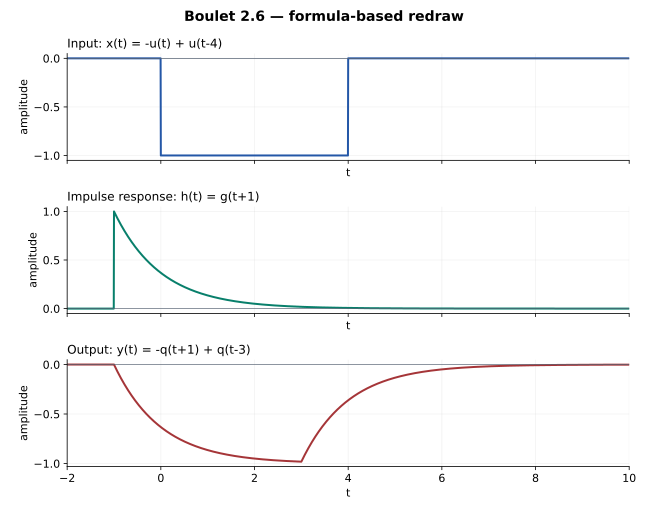

# 2.6 — 提前的冲激响应与负矩形输入

## 题意（重述）

Boulet p.87，Figure 2.44 给出

\[
h(t)=e^{-(t+1)}u(t+1),\qquad x(t)=-u(t)+u(t-4).
\]

求 \(y=h*x\)。注意输入在 \([0,4)\) 上为 \(-1\)，冲激响应在 \(t=-1\) 就开始。

## 先画平移交换图

取 \(g=e^{-t}u(t)\)、\(q=g*u\)。这里

\[
h=\tau_{-1}g,\qquad x=-(I-\tau_4)u.
\]

令 \(T=-\tau_{-1}(I-\tau_4)\)，则

\[
\begin{array}{ccc}
u & \xrightarrow{C_g} & q\\
{\scriptstyle T}\downarrow && \downarrow{\scriptstyle T}\\
Tu & \xrightarrow{C_g} & Tq
\end{array}
\]

输出就是 \(Tq\)。提前量与输入结束时间组合为 \(-1\) 和 \(3\)，不需要重新做一遍卷积积分。

## 代入基本响应

\[
q(t)=(1-e^{-t})u(t),
\]

\[
\boxed{y(t)=-q(t+1)+q(t-3).}
\]

分段式为

\[
y(t)=\begin{cases}
0,&t<-1,\\
-(1-e^{-(t+1)}),&-1\le t<3,\\
e^{-(t+1)}-e^{-(t-3)},&t\ge3.
\end{cases}
\]

最后一段为 \(-(1-e^{-4})e^{-(t-3)}\)。

## 画图与核对

输出从 \(t=-1\) 开始下降；\(t=3\) 时为 \(-(1-e^{-4})\)，随后从负侧衰减到零。各切换点连续，且 \(h\ge0,x\le0\)，因此 \(y\le0\)。面积满足 \(\int y=(\int h)(\int x)=-4\)。

本题系统**非因果**：\(h\) 在负时间非零。因此输入从 \(t=0\) 才开始，输出提前至 \(t=-1\) 出现并不矛盾。这是题设系统本身的性质。

还可以用

\[
y'+y=x(t+1)
\]

逐段核对。

## Osgood 对应观点

§3.3，pp.167–169；§8.6，pp.501–502；§8.8，pp.509–511。这里的关键是把提前写成 \(\tau_{-1}\)，不把它误当成延迟。

---

[返回目录](index.md) · [共用模块：2.2](2-2.md)
