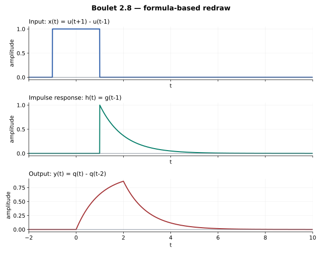

# 2.8 — 输入提前与系统延迟相互抵消

## 题意（重述）

Boulet pp.88–89，Figure 2.46：

\[
h(t)=e^{-(t-1)}u(t-1),\qquad x(t)=u(t+1)-u(t-1).
\]

求并画出 \(y=h*x\)。输入是 \([-1,1)\) 上高为 1 的矩形。

## 先合并平移

令 \(g=e^{-t}u(t)\)、\(q=g*u\)，则

\[
h=\tau_1g,\qquad x=(\tau_{-1}-\tau_1)u.
\]

卷积的两个平移量相加：

\[
\tau_1(\tau_{-1}-\tau_1)=I-\tau_2.
\]

因此这题与普通宽度 2 的矩形输入作用于 \(g\) 完全等价。交换图为

\[
\begin{array}{ccc}
u & \xrightarrow{C_g} & q\\
{\scriptstyle I-\tau_2}\downarrow && \downarrow{\scriptstyle I-\tau_2}\\
(I-\tau_2)u & \xrightarrow{C_g} & (I-\tau_2)q
\end{array}
\]

## 输出

\[
\boxed{y(t)=q(t)-q(t-2),\qquad q(t)=(1-e^{-t})u(t).}
\]

所以

\[
y(t)=\begin{cases}
0,&t<0,\\
1-e^{-t},&0\le t<2,\\
e^{-(t-2)}-e^{-t},&t\ge2.
\end{cases}
\]

最后一段也可写成 \((1-e^{-2})e^{-(t-2)}\)。

## 画图与核对

输出起点为 \((-1)+1=0\)；在 \(t=2\) 达到 \(1-e^{-2}\)，随后衰减。输出处处非负且切换连续。面积为 \(\int y=2\)。

等效系统的关系为

\[
y'+y=u(t)-u(t-2).
\]

这与上面三段表达式吻合。原系统 \(h\) 仍然因果；输入只是从负时间就已开始。

## Osgood 对应观点

§3.3，pp.167–169；§8.6，尤其 pp.501–502。两次平移在算子层面先合并，再计算，比反复翻转信号更省事。

---

[返回目录](index.md) · [共用模块：2.2](2-2.md)
