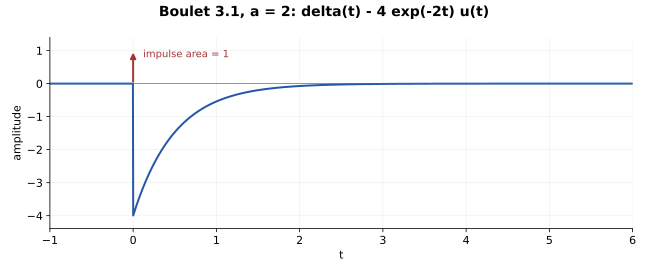

# 3.1 — 微分分子怎样产生直接通路

## 题意（重述）

Boulet pp.119–120：初始静止的因果 LTI 系统满足

\[
y'(t)+ay(t)=x'(t)-2x(t),\qquad a>0.
\]

(a) 求冲激响应并在 \(a=2\) 时画图；(b) 判断 BIBO 稳定性。

## 先求一个基本因果逆算子

方程写成 \((D+a)y=(D-2)x\)。令

\[
g_a=e^{-at}u(t),\qquad (D+a)g_a=\delta.
\]

因此 \(C_{g_a}\) 是这里零状态因果选择下的 \((D+a)^{-1}\)。先作 \(D-2\) 再作 \(C_{g_a}\)，或交换这两个操作，结果相同：

\[
\begin{array}{ccc}
x & \xrightarrow{D-2} & (D-2)x\\
{\scriptstyle C_{g_a}}\downarrow && \downarrow{\scriptstyle C_{g_a}}\\
C_{g_a}x & \xrightarrow{D-2} & y
\end{array}
\]

## (a) 对基本核求导即可

输入设为 \(\delta\)。因为 \(C_{g_a}\delta=g_a\)，

\[
h=(D-2)g_a.
\]

分布求导必须保留阶跃的跳变：

\[
D(e^{-at}u(t))=-ae^{-at}u(t)+\delta(t).
\]

所以

\[
\boxed{h(t)=\delta(t)-(a+2)e^{-at}u(t).}
\]

也可以从代数拆分直接读出：

\[
H(s)=\frac{s-2}{s+a}=1-\frac{a+2}{s+a}.
\]

第一项是恒等通路，第二项是一阶动态通路。\(a=2\) 时，\(h=\delta-4e^{-2t}u(t)\)。图中的竖直箭头表示冲激**面积 1**，不是有限高度；普通部分在 \(0^+\) 为 \(-4\)，从负侧趋于零。

## (b) BIBO 稳定性

对有界输入，

\[
y=x-(a+2)(g_a*x).
\]

\[
\|y\|_\infty\le
\left(1+\frac{a+2}{a}\right)\|x\|_\infty,
\]

因为 \(\int_0^\infty e^{-at}dt=1/a\)。因此 \(a>0\) 时 BIBO 稳定。\(\delta\) 本身是有界增益的直接通路，不应当把它当作 \(\delta'\) 的微分器。

## 两种核对

代回分布方程：

\[
(D+a)h=(D-2)(D+a)g_a=\delta'-2\delta.
\]

总面积也与直流增益一致：

\[
\int h=1-\frac{a+2}{a}=-\frac2a=H(0).
\]

## Osgood 对应观点

§3.3，pp.167–169：微分与卷积；§3.5，pp.174–175：微分多项式；§4.6，尤其 pp.286–287：阶跃的分布导数；§8.4 的系统串联。

---

[返回目录](index.md)

## Lathi 对应或类似习题（第三版）

2.3-4、2.5-1。
