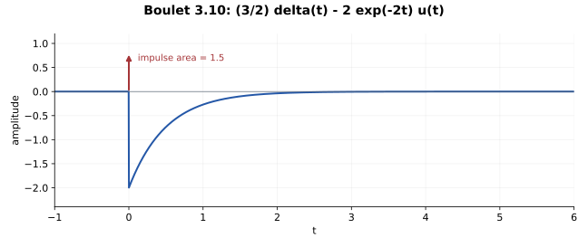

# 3.10 — 多项式除法先读出冲激项

## 题意（重述）

Boulet p.129：初始静止的因果一阶 LTI 系统满足

\[
2y'+4y=3x'+2x.
\]

求并画出冲激响应。

## 先拆成直接通路与动态通路

在零状态因果表示中，

\[
H(s)=\frac{3s+2}{2s+4}
=\frac32-\frac2{s+2}.
\]

这一步多项式除法已经决定了冲激的系数。令 \(g_2=e^{-2t}u(t)\)，则

\[
S=\frac32I-2C_{g_2}.
\]

输入分别进入增益 \(3/2\) 的直接支路，以及增益 \(-2\) 的一阶支路，再相加。

## 计算交换图

\[
\begin{array}{ccc}
x & \xrightarrow{\frac32I-2C_{g_2}} & y\\
{\scriptstyle\mathcal F}\downarrow && \downarrow{\scriptstyle\mathcal F}\\
X & \xrightarrow{\times [\frac32-\frac2{2+2\pi i\nu}]} & Y
\end{array}
\]

时域恒等算子对应频域常数增益；所以高频传递函数趋于 \(3/2\)，冲激响应便含 \((3/2)\delta\)。

## 冲激响应

\[
\boxed{h(t)=\frac32\delta(t)-2e^{-2t}u(t).}
\]

图中箭头表示面积 \(3/2\)；普通函数部分在 \(t=0^+\) 为 \(-2\)，向零衰减。不能将箭头高度解释为 \(h(0)\) 的有限数值。

也可从微分基本核得到相同答案：

\[
h=\frac12(3D+2)g_2
=\frac12\bigl(3(\delta-2g_2)+2g_2\bigr)
=\frac32\delta-2g_2.
\]

## 核对

利用 \((D+2)g_2=\delta\)：

\[
(2D+4)h=3\delta'+6\delta-4\delta=3\delta'+2\delta,
\]

恰为输入 \(x=\delta\) 时的右端。直流增益核对为

\[
\int h=\frac32-2\cdot\frac12=\frac12=H(0).
\]

阶跃响应为

\[
(h*u)(t)=\left(\frac12+e^{-2t}\right)u(t).
\]

它先跳到 \(3/2\)，再趋于 \(1/2\)，也显示直接通路与动态通路各自的作用。BIBO 幅度界为 \(\|y\|_\infty\le(5/2)\|x\|_\infty\)。

## Osgood 对应观点

§3.5，pp.174–175；§4.6，pp.285–291；§8.7，pp.504–507。将微分分子先做除法，能在任何积分前识别直接通路。

---

[返回目录](index.md)
