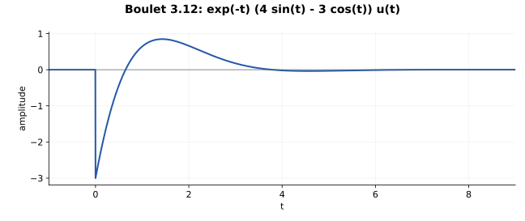

# 3.12 — 完成平方后，对一个衰减正弦核求导

## 题意（重述）

Boulet p.129：初始静止的因果二阶 LTI 系统满足

\[
y''+2y'+2y=-3x'+x.
\]

求冲激响应。

## 先找到最简单的分母核

\[
A(D)=D^2+2D+2=(D+1)^2+1.
\]

对应基本因果核是

\[
g(t)=e^{-t}\sin t\,u(t).
\]

对 \(t>0\)，\(g''+2g'+2g=0\)；其普通部分满足 \(g(0^+)=0,g'(0^+)=1\)，故按分布有 \(A(D)g=\delta\)。

## 分子与因果逆算子可以交换

方程写作 \(A(D)y=(I-3D)x\)。利用微分与卷积交换：

\[
\begin{array}{ccc}
x & \xrightarrow{I-3D} & (I-3D)x\\
{\scriptstyle C_g}\downarrow && \downarrow{\scriptstyle C_g}\\
C_gx & \xrightarrow{I-3D} & y
\end{array}
\]

因此把输入设为冲激后，\(h=(I-3D)g\)。

## 只需一次求导

因为 \(e^{-t}\sin t\) 在原点为零，其一阶分布导数没有冲激项：

\[
Dg=e^{-t}(\cos t-\sin t)u(t).
\]

所以

\[
\boxed{h(t)=e^{-t}(4\sin t-3\cos t)u(t).}
\]

Laplace 代数给出同样的拆分：

\[
H(s)=\frac{-3s+1}{(s+1)^2+1}
=-3\frac{s+1}{(s+1)^2+1}
+4\frac1{(s+1)^2+1}.
\]

## 为什么没有冲激，却有跳变？

分母次数比分子高 1，\(H(s)\to0\)，没有直接冲激通路。但普通响应在 \(0^+\) 为 \(-3\)，所以从零跳到 \(-3\)。**有限跳变与冲激是两种不同对象。**

令 \(f=e^{-t}(4\sin t-3\cos t)\)，则 \(f(0)=-3,f'(0)=7\)，

\[
Dh=f'u-3\delta,
\]

\[
D^2h=f''u+7\delta-3\delta'.
\]

于是

\[
(D^2+2D+2)h
=(f''+2f'+2f)u+(7-6)\delta-3\delta'
=\delta-3\delta',
\]

完全符合题目的冲激输入方程。

## 波形与核对

也可写成

\[
h(t)=5e^{-t}\sin(t-\phi)u(t),\qquad
\phi=\arctan(3/4).
\]

振荡角频率为 \(1\)，包络衰减率为 \(1\)。从 \(-3\) 开始，第一次过零在 \(t=\phi\)。绝对幅度不超过 \(5e^{-t}\)，因而 BIBO 稳定。

面积核对：

\[
\int h=4\cdot\frac12-3\cdot\frac12=\frac12=H(0).
\]

## Osgood 对应观点

§3.3，pp.167–169；§3.5，pp.174–175；§4.6，pp.285–291。完成平方识别基本核，再对核作用分子，可以把复杂跳变条件留到最后作为核对。

---

[返回目录](index.md)
