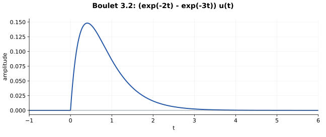

# 3.2 — 二阶系统分解成两个一阶系统

## 题意（重述）

Boulet pp.121–122：初始静止的因果 LTI 系统满足

\[
y''+5y'+6y=x.
\]

求冲激响应。

## 先分解微分多项式

\[
A(D)=D^2+5D+6=(D+2)(D+3).
\]

令 \(g_2=e^{-2t}u(t)\)、\(g_3=e^{-3t}u(t)\)，分别为两个一阶因果逆算子的核。系统可以先后通过这两个一阶系统。

\[
\begin{array}{ccc}
x & \xrightarrow{C_{g_3}C_{g_2}} & y\\
{\scriptstyle\mathcal F}\downarrow && \downarrow{\scriptstyle\mathcal F}\\
X & \xrightarrow{\times H} & Y
\end{array}
\qquad H(\nu)=\frac1{(2+2\pi i\nu)(3+2\pi i\nu)}.
\]

同样的代数在 Laplace 变量下为

\[
H(s)=\frac1{(s+2)(s+3)}=\frac1{s+2}-\frac1{s+3}.
\]

## 直接得到冲激响应

\[
\boxed{h(t)=(e^{-2t}-e^{-3t})u(t).}
\]

卷积核对只需一行：

\[
g_2*g_3=\left(\int_0^t e^{-2\tau}e^{-3(t-\tau)}d\tau\right)u(t)
=(e^{-2t}-e^{-3t})u(t).
\]

这种算法把“两组跳变条件＋两个待定系数”换成“一阶模块＋部分分式”。

## 因果初值与分布核对

令 \(f=e^{-2t}-e^{-3t}\)。由于 \(f(0)=0\)、\(f'(0)=1\)，

\[
Dh=f'u,\qquad D^2h=f''u+\delta.
\]

而 \(f''+5f'+6f=0\)，故

\[
(D^2+5D+6)h=\delta.
\]

这也说明原题的跳变条件 \(h(0^+)=0,h'(0^+)=1\) 已被因果核自动满足。

## 画图与额外核对

\(h\ge0\)，从零开始上升，在 \(t=\log(3/2)\) 达到峰值 \(4/27\)，随后衰减。面积为

\[
\int h=\frac12-\frac13=\frac16=H(0).
\]

该输入输出映射 BIBO 稳定，两个自然模态也都衰减。

## Osgood 对应观点

§3.3，pp.167–169；§3.5，pp.174–175；§8.4，pp.492–493；§8.7，pp.504–507。与 [2.10](2-10.md) 使用完全相同的串联转并联代数。

---

[返回目录](index.md)

## Lathi 对应或类似习题（第三版）

2.3-2、2.2-4。
