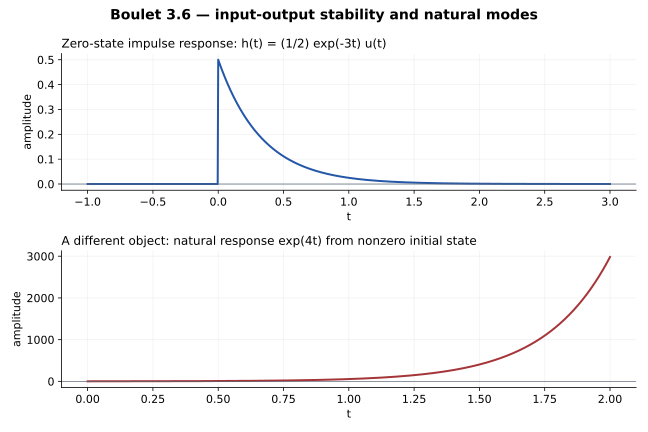

# 3.6 — 消去共同因子以后，哪一种稳定性成立？

## 题意（重述）

Boulet p.128：判断以下因果 LTI 微分系统的稳定性：

\[
2y''-2y'-24y=x'-4x.
\]

本题必须说明“稳定”指零状态输入输出的 BIBO 稳定，还是包含任意初始条件的自然响应稳定。

## 先看算子方程

\[
2(D-4)(D+3)y=(D-4)x.
\]

定义

\[
w=2(D+3)y-x.
\]

则原方程等价于

\[
(D-4)w=0\quad\Longrightarrow\quad w=Ce^{4t}.
\]

所以**原微分方程本身不能无条件约掉 \(D-4\)**。这个算子的核含有 \(e^{4t}\)，不是只有零函数。

## 因果零状态映射：共同因子可以消去

在零状态因果分布的解选择下，增长项的系数必须为零，因而

\[
2(D+3)y=x.
\]

原因不是“指数函数被禁止”，而是非零 \(Ce^{4t}\) 在整个时间轴上不可能具有零过去；若把它乘以 \(u(t)\) 强制因果，\((D-4)(Ce^{4t}u)=C\delta\ne0\)。

在零初值的 Laplace 表示中，这一选择写成

\[
H(s)=\frac{s-4}{2(s-4)(s+3)}=\frac1{2(s+3)}.
\]

对应的输入输出交换图为

\[
\begin{array}{ccc}
x & \xrightarrow{C_h} & y\\
{\scriptstyle\mathcal F}\downarrow && \downarrow{\scriptstyle\mathcal F}\\
X & \xrightarrow{\times [2(3+2\pi i\nu)]^{-1}} & Y
\end{array}
\]

该图针对已选定的零状态输入输出算子。这里的 \(s=4\) 是比值的可去奇点，不是这个约简后传递函数的极点。

## BIBO 结论

\[
\boxed{h(t)=\frac12e^{-3t}u(t).}
\]

\[
\|y\|_\infty\le\|h\|_1\|x\|_\infty
=\frac16\|x\|_\infty.
\]

因此**零状态的因果输入输出系统 BIBO 稳定**。

可直接核对冲激方程：\(2(D+3)h=\delta\)，再作用 \(D-4\) 得到

\[
2(D-4)(D+3)h=\delta'-4\delta.
\]

## 任意初值：增长自然模态仍然存在

令 \(x=0\)，原二阶齐次方程允许

\[
y_{mathrm{natural}}=C_1e^{4t}+C_2e^{-3t}.
\]

若 \(C_1\ne0\)，响应增长。例如从 \(t=0\) 给出 \(y(0)=1,y'(0)=4\)，就得到 \(y=e^{4t}\)。这种初始状态的效应不属于零状态卷积 \(h*x\)。

因此完整二阶方程的自然响应**不是渐近稳定的**；保留增长模态的二阶状态实现也不是内部稳定的。把约简后的传递函数实现为一个一阶系统，则该一阶实现是稳定的。这几个判断针对不同对象。

| 对象 | 结论 | 判断依据 |
| --- | --- | --- |
| 零状态因果输入输出映射 | BIBO 稳定 | \(h=\tfrac12e^{-3t}u\in L^1\) |
| 原二阶齐次方程的所有自然响应 | 不渐近稳定 | 存在 \(e^{4t}\) |
| 约简后的一阶状态实现 | 稳定 | 只含 \(-3\) 模态 |

## 与教材判据如何对照

Boulet pp.112–114 通过左端特征根讨论稳定性。本题左端特征根确实是 \(4,-3\)，所以按自然模态判断是不稳定；但若问题严格指零状态 BIBO 稳定，仅看未约简分母会忽略右端消去。因此应把上述两种结论及其条件写清楚。

## Osgood 对应观点

§3.5.1，pp.174–175：变换求解依赖允许的函数空间，可能不包含一般齐次解；§8.7：输入输出的频域乘法表示；§8.8：因果解的选择。极零消去与两种稳定性的区分是对本题进一步作出的分析。

---

[返回目录](index.md)

## Lathi 对应或类似习题（第三版）

2.5-1、2.5-2。
